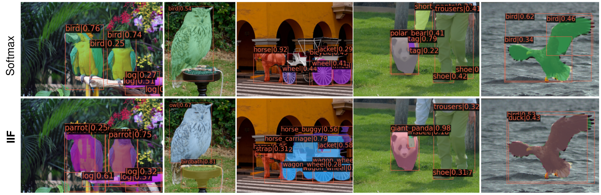

<h1> Inverse Image Frequence for Long-tailed Image Recognition </h1>

<p align="center">
  
</p>
<p>
<b>Abstract</b>
 The long-tailed distribution is a common phenomenon in the real world. Extracted large scale image datasets inevitably demonstrate the long-tailed property and models trained with imbalanced data can obtain high performance for the over-represented categories, but struggle for the under-represented categories, leading to biased predictions and performance degradation. To address this challenge, we propose a novel de-biasing method named <i>Inverse Image Frequency (IIF)</i>. IIF is a multiplicative margin adjustment transformation of the logits in the classification layer of a convolutional neural network. Our method achieves stronger performance than similar works and it is especially useful for downstream tasks such as long-tailed instance segmentation as it produces fewer false positive detections. Our extensive experiments show that IIF surpasses the state of the art on many long-tailed benchmarks such as ImageNet-LT, CIFAR-LT, Places-LT and LVIS, reaching 55.8 top-1 accuracy with ResNet50 on ImageNet-LT and 26.3 segmentation AP with MaskRCNN ResNet50 on LVIS.
</p>

### Progress

- [x] Training code.
- [x] Evaluation code.
- [x] LVIS v1.0, ImageNet-LT, Places-LT datasets.
- [x] Provide classification checkpoint models.
- [x] Provide instance segmentation checkpoint models.


<h1> Tested with </h1>
<div>
 <ul>
  <li>python==3.8.12</li>
  <li>torch==1.7.1</li>
  <li>torchvision==0.8.2</li>
  <li>mmdet==2.15.1</li>
  <li>lvis</li>
  <li>Tested on CUDA 10.1,10.0</li>
</ul> 
</div>
<b>Please Note that there is a reproducibility issue when using CUDA 10.2, as it drops classification performance by ~5%. For this reason please use either cuda 10.1 or cuda 10.0. Other versions are not tested.</b>

<h1> Getting Started </h1>
Create a virtual environment

```
conda create --name mmdet pytorch=1.7.1 -y
conda activate mmdet
```

1. Install dependency packages
```
conda install torchvision -y
conda install pandas scipy -y
conda install opencv -y
pip install catalyst
pip install imgaug
pip install randaugment
```

2. Install MMDetection
```
pip install openmim
mim install mmdet==2.15.1
```
3. Clone this repo
```
git clone https://github.com/kostas1515/iif.git
cd iif
```

### Datasets
For COCO and LVIS datasets:
1. Create data directory, download COCO 2017 datasets at https://cocodataset.org/#download (2017 Train images [118K/18GB], 2017 Val images [5K/1GB], 2017 Train/Val annotations [241MB]) and extract the zip files:

```
mkdir data
cd data
wget http://images.cocodataset.org/zips/train2017.zip
wget http://images.cocodataset.org/zips/val2017.zip

#download and unzip LVIS annotations
wget https://s3-us-west-2.amazonaws.com/dl.fbaipublicfiles.com/LVIS/lvis_v1_train.json.zip
wget https://s3-us-west-2.amazonaws.com/dl.fbaipublicfiles.com/LVIS/lvis_v1_val.json.zip

```

2. modify mmdetection/configs/_base_/datasets/lvis_v1_instance.py and make sure data_root variable points to the above data directory, e.g., data_root= "\<user_path\>"

For ImageNet and Places-LT:
1. Download the [ImageNet_2014](http://image-net.org/index) and [Places_365](http://places2.csail.mit.edu/download.html).


## Citation
     @article{alexandridis2023inverse,
      title={Inverse Image Frequency for Long-tailed Image Recognition},
      author={Alexandridis, Konstantinos Panagiotis and Luo, Shan and Nguyen, Anh and Deng, Jiankang and Zafeiriou, Stefanos},
      journal={IEEE Transactions on Image Processing},
      year={2023},
      publisher={IEEE}
    }

<h1> Acknowledgements </h1>
     This code uses the <a href='https://github.com/open-mmlab/mmdetection'>mmdet</a> framework for instance segmentation. For classification, it uses <a href='https://github.com/dvlab-research/MiSLAS'>MiSLAS</a> and <a href='https://github.com/kaidic/LDAM-DRW'>LDAM</a>. Thank you for your wonderfull work! 

